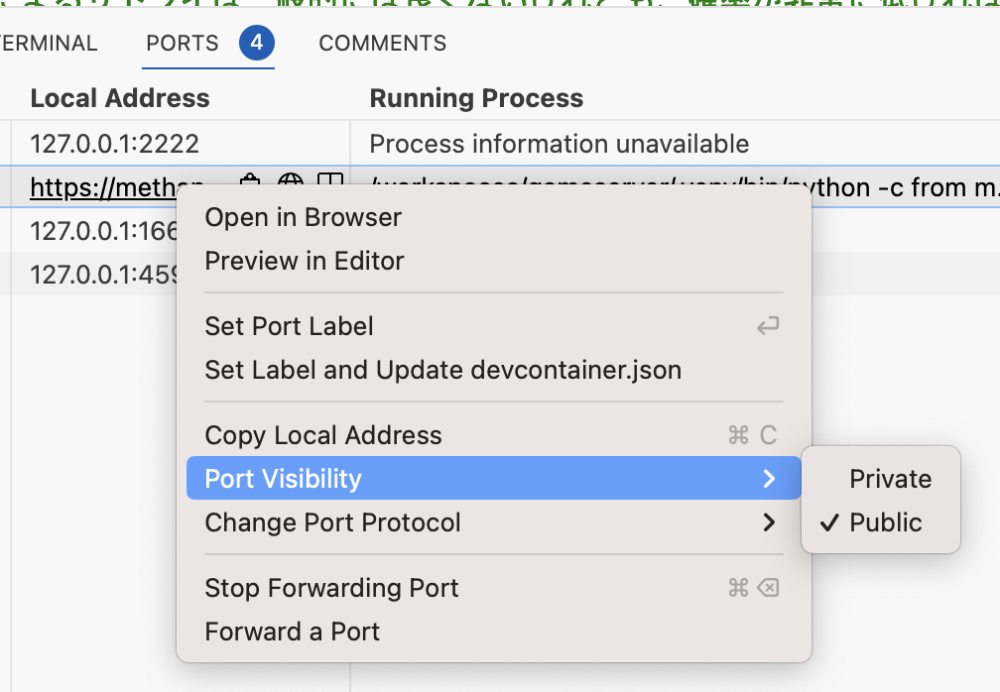
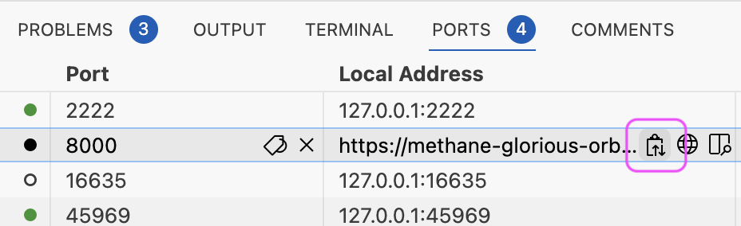
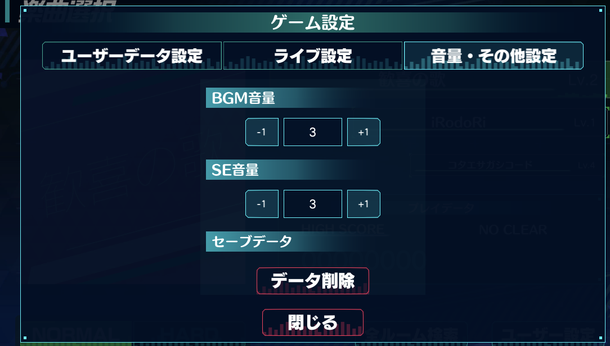

# マルチプレイのテスト方法

## 1. ポートを公開する

- サーバーを起動します (make run)
- PORTS パネルから 8000番ポートを右クリックし、 "Port Visibility" を "Public" にします。

  

- コピーボタンを使って Local Address をコピーする、あるいは右クリックから"Copy Local Address"を選択します。

  

- `server_config.json` を開きます。
- `"ServerAddress"` の値をコピーしたアドレスに、 `"Port"` を `"443"` に変更します。

    ```json
    {"ServerAddress":"https://methane-g...w-8000.preview.app.github.dev", "Port":"443"}
    ```

- ゲームを再起動して、ユーザーをリセットします。

   

- 動作確認したら、 `server_config.json` ファイルを共有してください。
